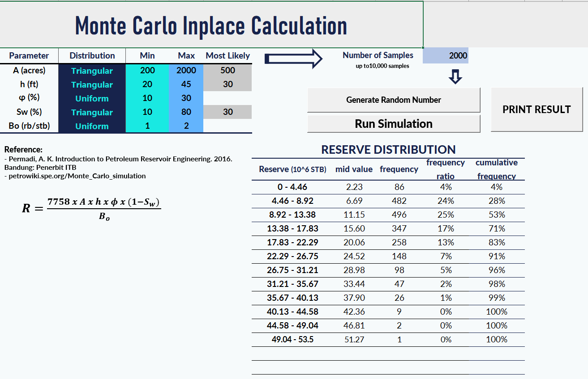
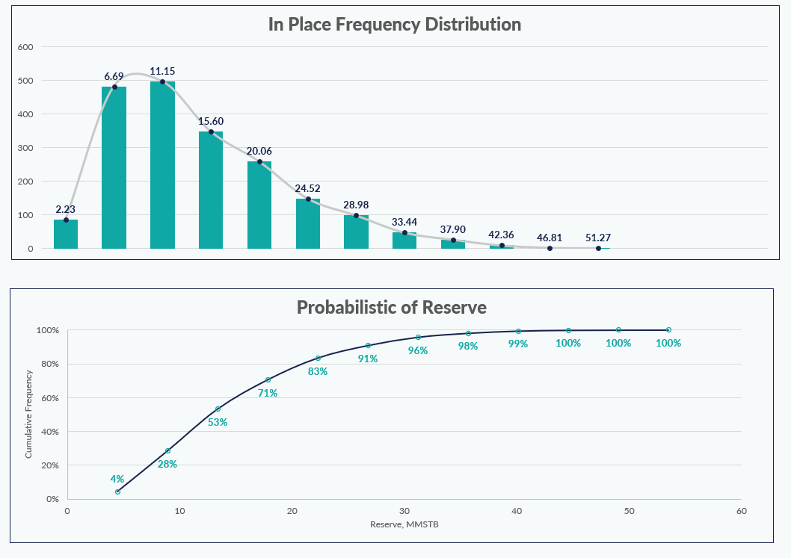

# monte carlo inplace simulation
## interactive original in place calculation build on Excel using VBA 
\

## no load data required, only input parameters to cells and click run simulation button
\

## The result of simulation are excel charts and can be saved or modified

